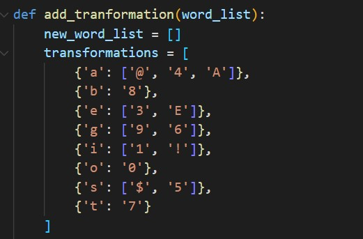

------

<h2>Présentation</h2>

Ce projet est à la destination des personnes qui se retrouvent dans la situation où ils doivent créer une liste de mots. Pour brute force un mot de passe ou vérifier les différents URL disponibles sur un site. La liste d’origine peut contenir (mot, prénom, nom, numéro, adresse, date de naissance, etc.). L’objectif est d’automatiser la chose pour gagner du temps et créer des listes qui correspondent à des cas particuliers.
Exemple : dans le cas de l'entreprise "ISEN", nous souhaitons générer une liste de mots de passe telle que : isen2018, isen2022, 1s3n2018, 1s3n2022,…

<h2>Video de présentation du projet</h2>

https://user-images.githubusercontent.com/61002169/206292804-0a3049af-56d0-458c-bb7a-aa044d2e269b.mp4

<h2>Transformation</h2>

Nous avons implémenté les transformations suivantes : 

<h2>Ligne de commande</h2>

Utilisation : 

    ./main.py [_input.txt] [OPTIONS]
         -t : transformation des mots de la liste
         -o file.txt : export la liste de mot dans file.txt
         -c  'COMMAND': Appliquer la commande COMMAND a la liste de mot
            # = word
            * = digit
            @ = special characters
    

    Example : ./main.py test.txt -c '#***' 
    Pour chaque mot de la liste test.txt, ajouter un caractère spécial et quatre chiffres

<h2>Docker</h2>

    Le programme est récupérable via Docker sous le nom <strong>saltas44/wlg_light:latest</strong>.
    
    Pour se faire :
        docker pull saltas44/wlg_light:latest
    Puis pour lancer ce container :
        docker run -d -p 8080:80 wlg_light
        
    Vous pouvez ainsi accéder au site via http://localhost:8080 sur votre machine.

<h5>Shell</h5>

    Il est aussi possible d'utiliser les scripts shell adaptés pour wlg_light disponible dans le dossier shell.
    
    Voici la liste des scripts disponibles :
        - get_docker.sh
            --> Equivalent au docker pull du projet
        - run_docker.sh
            --> Equivalent a faire un docker run
        - stop_docker.sh
            --> Stop le docker du wlg_light grâce à son ID de container
    
    Exemple : ./get_docker.sh
              ./run_docker.sh
              ./stop_docker.sh
    Accéder ensuite au site via http://localhost:8080 sur votre machine.

